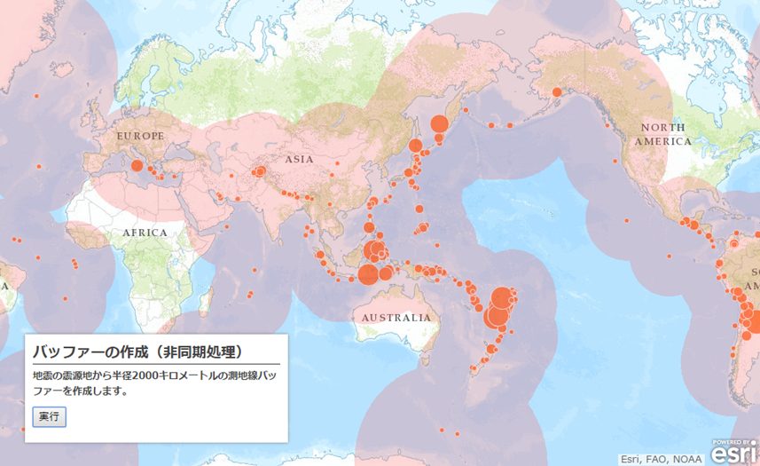

# Geometry Engine

## サンプル
* [測地線バッファー(同期)](http://esrijapan.github.io/arcgis-samples-js/geometry-engine/sync_eq.html)
* [測地線バッファー(非同期)](http://esrijapan.github.io/arcgis-samples-js/geometry-engine/async_eq.html)

## リソース

* [ArcGIS API for JavaScript](https://developers.arcgis.com/javascript/)
> * [esri/geometry/geometryEngine](https://developers.arcgis.com/javascript/jsapi/esri.geometry.geometryengine-amd.html)
> * [esri/geometry/geometryEngineAsync](https://developers.arcgis.com/javascript/jsapi/esri.geometry.geometryengineasync-amd.html)
