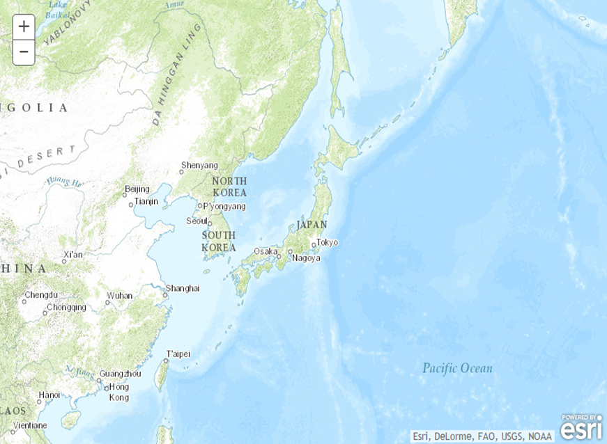

# Map

## サンプル
* [地図表示](http://esrijapan.github.io/arcgis-samples-js/simple/map.html)
* [test](http://esrijapan.github.io/arcgis-samples-js/simple/test.html)

## リソース

* [ArcGIS API for JavaScript](https://developers.arcgis.com/javascript/)
    + [esri/map](https://developers.arcgis.com/javascript/jsapi/map-amd.html)
    + [esri/layers/FeatureLayer](https://developers.arcgis.com/javascript/jsapi/featurelayer-amd.html)
    + [esri/dijit/Search](https://developers.arcgis.com/javascript/jsapi/search-amd.html)
    + [esri/dijit/LocateButton](https://developers.arcgis.com/javascript/jsapi/locatebutton-amd.html)
* Samples
    + [On demand mode](https://developers.arcgis.com/javascript/jssamples/fl_ondemand.html)
    + [Search basic](https://developers.arcgis.com/javascript/jssamples/search_basic.html)
    + [Locate Button](https://developers.arcgis.com/javascript/jssamples/widget_locate.html)
