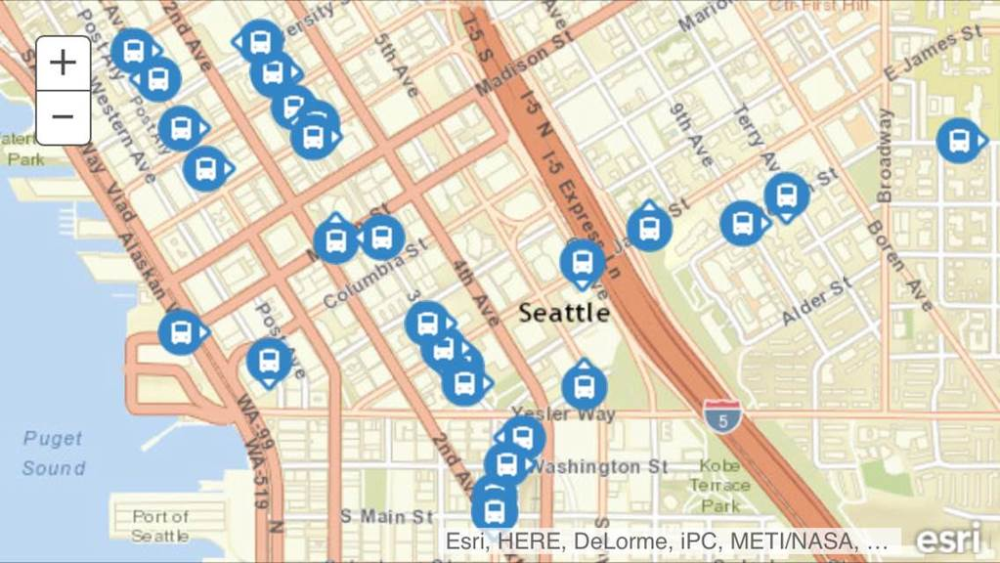

# Stream Layer

## サンプル
[公共バスのモニタリング](http://esrijapan.github.io/arcgis-samples-js/stream-layer/seattlebus.html)

## リソース

* [ArcGIS API for JavaScript](https://developers.arcgis.com/javascript/)
> [esri/layers/StreamLayer](https://developers.arcgis.com/javascript/jsapi/streamlayer-amd.html)

* [ArcGIS GeoEvent Extension for Server](http://server.arcgis.com/ja/geoevent-extension/)
* [ストリーム サービス](http://server.arcgis.com/ja/server/latest/publish-services/windows/stream-services.htm)
